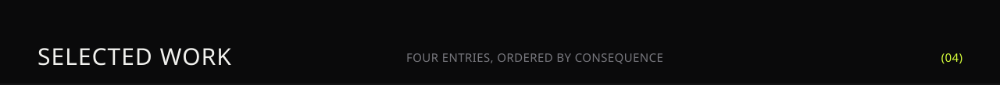
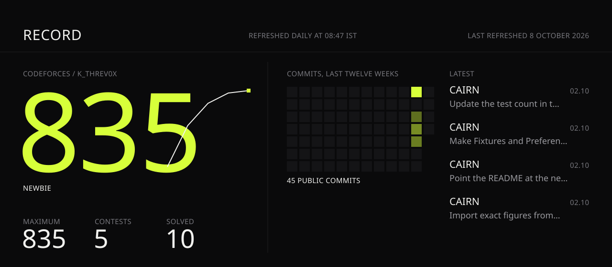
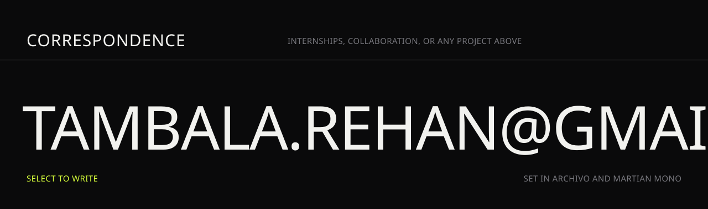

 

<a href="https://vector-wx2a.onrender.com">CAIRN, live</a> &nbsp;/&nbsp; <a href="https://www.linkedin.com/in/rehantambala/">LinkedIn</a> &nbsp;/&nbsp; <a href="https://codeforces.com/profile/K_threv0x">Codeforces</a> &nbsp;/&nbsp; <a href="https://www.codechef.com/users/k_threv0x">CodeChef</a> &nbsp;/&nbsp; <a href="https://www.hackerrank.com/profile/K_threv0x">HackerRank</a>

